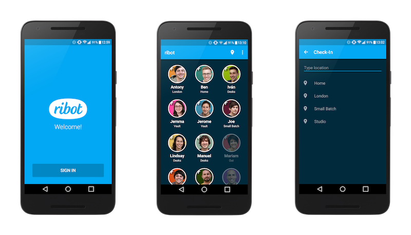

# ribot app Android

The official [ribot](http://ribot.co.uk) app for android. It follows the architecture, tools and guidelines that we use when developing for the Android platform (https://github.com/ribot/android-guidelines)

<p align="center">
    
</p>

The ribot app is an internal project based off of our [Android Boilerplate](https://github.com/ribot/android-boilerplate).
It was created to make us aware of our fellow ribots locations. Currently, the app allows you to:

- Sign in - Sign in using your @ribot.co.uk Google account
- Auto Check-in - Using Estimote beacons, the app will automatically check you in at your corresponding
location in the ribot studio
- Manual Check-in - Manually check yourself in at your current location
- Team listing - View a list of ribots and their current check-in status

We've open sourced this to both showcase our efforts and allow you to recreate the
experience in your own workplace - why not fork this project and give it a go?

## Libraries

The libraries and tools used include:

- Support library
- RecyclerViews and CardViews 
- [RxJava](https://github.com/ReactiveX/RxJava) and [RxAndroid](https://github.com/ReactiveX/RxAndroid) 
- [Retrofit](http://square.github.io/retrofit/) and [OkHttp](https://github.com/square/okhttp)
- [Dagger 2](http://google.github.io/dagger/)
- [Estimote Android SDK](https://github.com/Estimote/Android-SDK)
- [SqlBrite](https://github.com/square/sqlbrite)
- [EasyAdapter](https://github.com/ribot/easy-adapter)
- [Butterknife](https://github.com/JakeWharton/butterknife)
- [Timber] (https://github.com/JakeWharton/timber)
- [Glide](https://github.com/bumptech/glide)
- [Otto](http://square.github.io/otto/) event bus
- [Espresso](https://google.github.io/android-testing-support-library/)
- [Robolectric](http://robolectric.org/)
- [Mockito](http://mockito.org/)
- [Checkstyle](http://checkstyle.sourceforge.net/), [PMD](https://pmd.github.io/) and [Findbugs](http://findbugs.sourceforge.net/) for code analysis

## Requirements

- [Android SDK](http://developer.android.com/sdk/index.html).
- Android [6.0 (API 23) ](http://developer.android.com/tools/revisions/platforms.html#6.0).
- Android SDK Tools
- Android SDK Build tools 23.0.1
- Android Support Repository

## Build Instructions

In order to run this project, you'll need to setup several things beforehand:

- Our application uses the [ribot API](https://github.com/ribot/ribot-api) to handle data requests,
you'll need to clone this and configure it to your requirements. This application will not work without an API and the implementation
in this repository requires the use of an @ribot.co.uk email address, so your own API is required if you wish to clone this project.

- You'll need to set the values found in the [gradle.properties](gradle.properties) file.
This involves the web application client id (`ribotAppGoogleApiServerClientId`) and debug/release keystore locations, aliases and passwords. Ideally the
`UNDEFINED` values found in this file should be defined in the Global `gradle.properties` that lives in `~/.gradle/gradle.properties`

## Architecture

This project follows our Android architecture guidelines. Read more about them [here](https://github.com/ribot/android-guidelines/blob/master/architecture_guidelines/android_architecture.md). 


## Code Quality

This project integrates a combination of unit tests, functional test and code analysis tools. 

### Tests

To run **unit** tests on your machine:

``` 
./gradlew test
``` 

To run **functional** tests on connected devices:

``` 
./gradlew connectedAndroidTest
``` 

Note: For Android Studio to use syntax highlighting for Automated tests and Unit tests you **must** switch the Build Variant to the desired mode.

### Code Analysis tools 

The following code analysis tools are set up on this project:

* [PMD](https://pmd.github.io/): It finds common programming flaws like unused variables, empty catch blocks, unnecessary object creation, and so forth. See [this project's PMD ruleset](config/quality/pmd/pmd-ruleset.xml).

``` 
./gradlew pmd
```

* [Findbugs](http://findbugs.sourceforge.net/): This tool uses static analysis to find bugs in Java code. Unlike PMD, it uses compiled Java bytecode instead of source code.

```
./gradlew findbugs
```

* [Checkstyle](http://checkstyle.sourceforge.net/): It ensures that the code style follows [our Android code guidelines](https://github.com/ribot/android-guidelines/blob/master/project_and_code_guidelines.md#2-code-guidelines). See our [checkstyle config file](config/quality/checkstyle/checkstyle-config.xml).

```
./gradlew checkstyle
```

### The check task

To ensure that your code is valid and stable use check: 

```
./gradlew check
```

This will run all the code analysis tools and unit tests in the following order:


# Licence

```
Copyright 2015 Ribot Ltd.

Licensed under the Apache License, Version 2.0 (the "License");
you may not use this file except in compliance with the License.
You may obtain a copy of the License at

    http://www.apache.org/licenses/LICENSE-2.0

Unless required by applicable law or agreed to in writing, software
distributed under the License is distributed on an "AS IS" BASIS,
WITHOUT WARRANTIES OR CONDITIONS OF ANY KIND, either express or implied.
See the License for the specific language governing permissions and
limitations under the License.
```